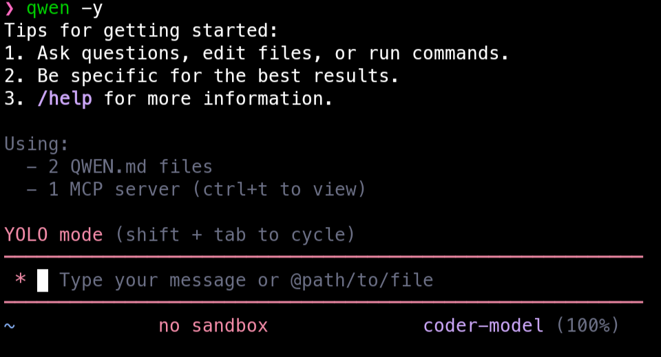

<div align="center">

[](https://www.npmjs.com/package/@mmmbuto/qwen-code-termux)
[](./LICENSE)
[](https://nodejs.org/)
[](https://www.npmjs.com/package/@mmmbuto/qwen-code-termux)
[](https://ko-fi.com/dionanos)

**An open-source AI agent that lives in your terminal — Termux Edition (Android).**

<a href="https://qwenlm.github.io/qwen-code-docs/zh/users/overview">中文</a> |
<a href="https://qwenlm.github.io/qwen-code-docs/de/users/overview">Deutsch</a> |
<a href="https://qwenlm.github.io/qwen-code-docs/fr/users/overview">français</a> |
<a href="https://qwenlm.github.io/qwen-code-docs/ja/users/overview">日本語</a> |
<a href="https://qwenlm.github.io/qwen-code-docs/ru/users/overview">Русский</a> |
<a href="https://qwenlm.github.io/qwen-code-docs/pt-BR/users/overview">Português (Brasil)</a>

</div>

Qwen Code is an open-source AI agent for the terminal, optimized for **Qwen3-Coder**.  
This repository/package is a **Termux-first build** that keeps upstream behavior, while fixing the parts that commonly break on Android/Termux (notably PTY and a few runtime quirks).

> **Not on Termux?** Use upstream: `npm install -g @qwen-code/qwen-code@latest` (or Homebrew).  
> **On Termux?** Use this package: `npm install -g @mmmbuto/qwen-code-termux@latest`.

<div align="center">
  
</div>

## Why a Termux Edition?

Upstream Qwen Code targets macOS/Linux/Windows. On Android/Termux, installs may fail due to native dependency issues (PTY / build tooling) and small environment differences.

Termux Edition focuses on:

- **Android PTY support** via `@mmmbuto/node-pty-android-arm64` (optional dependency)
- **Termux runtime patches** (polyfills/quirks, clipboard behavior)
- **Termux-safe install** (avoid node-gyp/husky pitfalls where possible)
- **Tested on-device** — see [QWEN_TEST_REPORT_v0.7.1-termux.md](./QWEN_TEST_REPORT_v0.7.1-termux.md)

## Installation (Termux / Android)

### Prerequisites

- Termux (recommended from F-Droid)
- Node.js **20+** (Termux `nodejs-lts` is recommended)

```bash
pkg update -y && pkg upgrade -y
pkg install -y nodejs-lts git
```

Optional (recommended) for extra tools:

- Install the **Termux:API** Android app
- Install the Termux package:

```bash
pkg install -y termux-api
```

### Install

```bash
npm install -g @mmmbuto/qwen-code-termux@latest
qwen --version
```

## Quick Start

```bash
# Start Qwen Code (interactive)
qwen

# Then, in the session:
/help
/auth
```

On first use, you'll be prompted to sign in. You can run `/auth` anytime to switch authentication methods.

Example prompts:

```text
What does this project do?
Explain the codebase structure.
Help me refactor this function.
Generate unit tests for this module.
```

<details>
<summary>Click to watch a demo video (upstream)</summary>

<video src="https://cloud.video.taobao.com/vod/HLfyppnCHplRV9Qhz2xSqeazHeRzYtG-EYJnHAqtzkQ.mp4" controls>
Your browser does not support the video tag.
</video>

</details>

## Authentication

Qwen Code supports two authentication methods:

- **Qwen OAuth (recommended & free)**: sign in with your `qwen.ai` account in a browser.
- **OpenAI-compatible API**: use `OPENAI_API_KEY` (and optionally a custom base URL / model).

### Qwen OAuth (recommended)

Start `qwen`, then run:

```bash
/auth
```

Choose **Qwen OAuth** and complete the browser flow. Your credentials are cached locally so you usually won't need to log in again.

### OpenAI-compatible API (API key)

Environment variables (recommended for CI / headless environments):

```bash
export OPENAI_API_KEY="your-api-key-here"
export OPENAI_BASE_URL="https://api.openai.com/v1"  # optional
export OPENAI_MODEL="gpt-4o"                        # optional
```

For details (including `.qwen/.env` loading and security notes), see the upstream authentication guide:
https://qwenlm.github.io/qwen-code-docs/en/users/configuration/auth/

## Usage

As an open-source terminal agent, you can use Qwen Code in four primary ways:

1. Interactive mode (terminal UI)
2. Headless mode (scripts, CI)
3. IDE integration (VS Code, Zed)
4. TypeScript SDK

### Interactive mode

```bash
cd your-project/
qwen
```

Run `qwen` in your project folder to launch the interactive terminal UI. Use `@` to reference local files (for example `@src/main.ts`).

### Headless mode

```bash
cd your-project/
qwen -p "your question"
```

Use `-p` to run Qwen Code without the interactive UI—ideal for scripts, automation, and CI/CD. Learn more:
https://qwenlm.github.io/qwen-code-docs/en/users/features/headless

### IDE integration

Use Qwen Code inside your editor (VS Code, Zed, and JetBrains IDEs):

- https://qwenlm.github.io/qwen-code-docs/en/users/integration-vscode/
- https://qwenlm.github.io/qwen-code-docs/en/users/integration-zed/
- https://qwenlm.github.io/qwen-code-docs/en/users/integration-jetbrains/

### TypeScript SDK

Build on top of Qwen Code with the TypeScript SDK:

- [Use the Qwen Code SDK](./packages/sdk-typescript/README.md)

## Commands & Shortcuts

### Session Commands

- `/help` - Display available commands
- `/clear` - Clear conversation history
- `/compress` - Compress history to save tokens
- `/stats` - Show current session information
- `/bug` - Submit a bug report
- `/exit` or `/quit` - Exit Qwen Code

### Keyboard Shortcuts

- `Ctrl+C` - Cancel current operation
- `Ctrl+D` - Exit (on empty line)
- `Up/Down` - Navigate command history

> Learn more about Commands:
> https://qwenlm.github.io/qwen-code-docs/en/users/features/commands/
>
> **Tip**: In YOLO mode (`--yolo`), vision switching happens automatically without prompts when images are detected. Learn more about Approval Mode:
> https://qwenlm.github.io/qwen-code-docs/en/users/features/approval-mode/

## Configuration

Qwen Code can be configured via `settings.json`, environment variables, and CLI flags.

- **User settings**: `~/.qwen/settings.json`
- **Project settings**: `.qwen/settings.json`

See settings docs for available options and precedence:
https://qwenlm.github.io/qwen-code-docs/en/users/configuration/settings/

## Termux Notes

### Storage access

To work with files under `/sdcard`, run once:

```bash
termux-setup-storage
```

### Clipboard

If you installed `termux-api` + the Termux:API app, clipboard actions can use Termux-native commands.

### PTY

On ARM64 Termux, PTY support is provided by `@mmmbuto/node-pty-android-arm64` (optional dependency).  
If PTY isn't available, Qwen Code falls back to non-PTY execution where possible.

## Changelog & Releases

- [CHANGELOG.md](./CHANGELOG.md)
- Latest Termux test report: [QWEN_TEST_REPORT_v0.7.1-termux.md](./QWEN_TEST_REPORT_v0.7.1-termux.md)

## Troubleshooting

If you encounter issues, check the upstream troubleshooting guide:
https://qwenlm.github.io/qwen-code-docs/en/users/support/troubleshooting/

To report a bug from within the CLI, run `/bug` and include a short title and repro steps.

### Termux-specific troubleshooting

- Make sure you are on **Node 20+** (`node -v`)
- Update packages (`pkg upgrade -y`)
- If OAuth browser flow fails, try again after `termux-open-url https://qwen.ai` (ensures the bridge is working)
- If you need Termux tools, install `termux-api` and the Android companion app


## Support

If this Termux edition helps you, you can support the project on Ko-fi:
- https://ko-fi.com/dionanos

## Connect with Upstream

- Discord: https://discord.gg/ycKBjdNd
- Dingtalk: https://qr.dingtalk.com/action/joingroup?code=v1,k1,+FX6Gf/ZDlTahTIRi8AEQhIaBlqykA0j+eBKKdhLeAE=&_dt_no_comment=1&origin=1

## Acknowledgments

This project is based on [Google Gemini CLI](https://github.com/google-gemini/gemini-cli). We acknowledge and appreciate the excellent work of the Gemini CLI team. Our main contribution focuses on parser-level adaptations to better support Qwen-Coder models.
