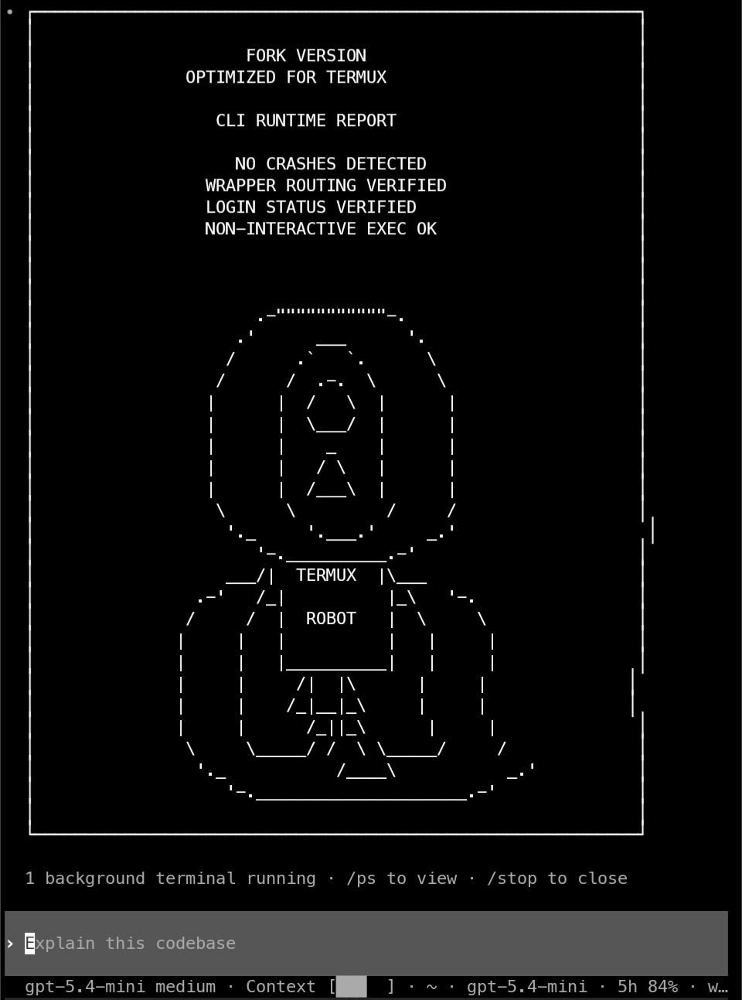

# Qwen Code Termux

> Native Qwen Code CLI for **Termux / Android ARM64**.
> This fork tracks upstream [QwenLM/qwen-code](https://github.com/QwenLM/qwen-code) closely and carries only the Android/Termux compatibility delta needed to package and run it.

[](https://www.npmjs.com/package/@mmmbuto/qwen-code-termux)
[](https://github.com/DioNanos/qwen-code-termux/releases/latest)
[](./LICENSE)

<p align="center">
  
</p>

## Install

### Termux (Android ARM64)

```bash
pkg update && pkg upgrade -y
pkg install nodejs-lts -y
pkg install termux-api -y   # optional, only for TTS notifications
npm install -g @mmmbuto/qwen-code-termux@latest
qwen --version
```

Requirements:

- Android 7+ / API 24+
- ARM64 device
- Termux from F-Droid (Google Play build is outdated)
- Node.js >= 20

### Other platforms

Use upstream:

```bash
npm install -g @qwen-code/qwen-code
```

## Scope

What this fork does:

- tracks upstream Qwen Code release by release
- preserves only the Android/Termux compatibility delta upstream does not ship
- publishes a Termux-ready npm package and GitHub release assets
- maintains a small, verifiable patch surface (`scripts/check-termux-patches.sh`)

What this fork does not do:

- maintain a broad feature fork or product divergence
- replace upstream Qwen Code on non-Termux platforms
- carry fork-only features unrelated to Termux compatibility
- publish SDKs, VS Code extensions, channels, or Docker images downstream

## Current Termux Delta

- Android ARM64 PTY fallback via `@mmmbuto/node-pty-android-arm64` (prebuilt, bundled as optional dependency)
- Termux runtime detection (`isTermux()` checks `process.platform`, `TERMUX_VERSION`, `PREFIX`)
- base64 polyfills (`btoa` / `atob`) for older Android Node builds
- `tts_notification` tool backed by `termux-tts-speak` (requires `termux-api`)
- `DEP0169` (`url.parse` deprecation) warning suppression in the CLI entry point
- install / update commands point users at `@mmmbuto/qwen-code-termux`
- `postinstall` + `prepare-termux` scripts skip husky and the bundle step inside Termux
- npm package metadata published under `@mmmbuto/qwen-code-termux`

Fork delta is verifiable end-to-end with:

```bash
bash scripts/check-termux-patches.sh
```

(16 markers across `getPty.ts`, `termux-detect.ts`, `termux-runtime.ts`, `tts-notification.ts`, `cli/index.ts`, `installationInfo.ts`, `scripts/`, `package.json`)

## Releases and Updates

- Latest GitHub release: [releases/latest](https://github.com/DioNanos/qwen-code-termux/releases/latest)
- Upstream baseline: [`QwenLM/qwen-code` v0.16.1](https://github.com/QwenLM/qwen-code/releases/tag/v0.16.1), packaged as `0.16.1-termux` for npm `latest`
- npm package: [`@mmmbuto/qwen-code-termux`](https://www.npmjs.com/package/@mmmbuto/qwen-code-termux)

Maintainer publish flow:

- merge upstream release tag into `develop`
- verify the Termux delta with `scripts/check-termux-patches.sh`
- build, bundle, prepare:package, smoke `qwen --version`
- publish the tested npm tarball to `latest`
- promote the tested commit to clean GitHub `main`
- publish the GitHub release from `main` with the tarball asset
- add post-release Termux validation reports after on-device testing

## Authentication

Qwen Code Termux keeps upstream Qwen Code authentication behavior. Interactive:

```text
/auth
```

API-key auth can be configured through `~/.qwen/settings.json` or upstream provider environment variables. For Alibaba Cloud ModelStudio / DashScope:

```bash
export DASHSCOPE_API_KEY="YOUR_API_KEY"
qwen
```

> The Qwen OAuth free tier was discontinued upstream on **April 15, 2026**. Use Alibaba Cloud Coding Plan, OpenRouter, Fireworks AI, or another configured API provider.

## Validation

Termux on-device smoke suite: [test-reports/suites/latest/termux.md](./test-reports/suites/latest/termux.md)

Minimum smoke:

```bash
qwen --version
qwen --help
qwen -p "Reply with OK"
```

Validation history under [test-reports/](./test-reports/).

## Documentation

- [Maintainer / scope of maintenance](./MAINTAINER.md)
- [Notice](./NOTICE)
- [Security policy](./SECURITY.md)
- Termux delta verifier: [scripts/check-termux-patches.sh](./scripts/check-termux-patches.sh)
- Latest Termux smoke suite: [test-reports/suites/latest/termux.md](./test-reports/suites/latest/termux.md)
- Upstream docs index: [docs/index.md](./docs/index.md)

For generic Qwen Code documentation, refer to [upstream](https://github.com/QwenLM/qwen-code).

## License

Apache-2.0. This project remains under the Apache 2.0 license inherited from upstream Qwen Code.

- Original work: Alibaba Cloud (Qwen Team)
- Termux port: minimal Android compatibility patches

See [LICENSE](./LICENSE).

---

*Per aspera ad astra.*
